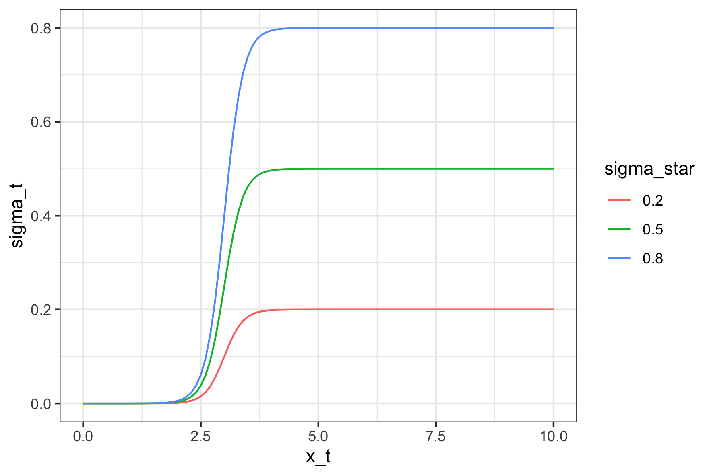
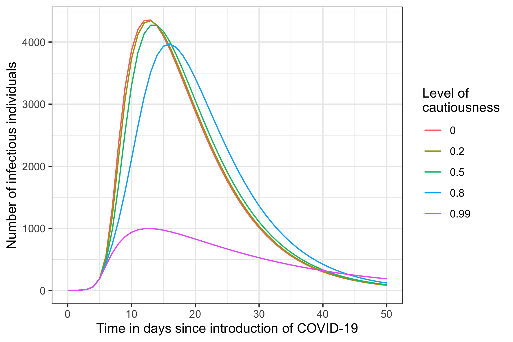
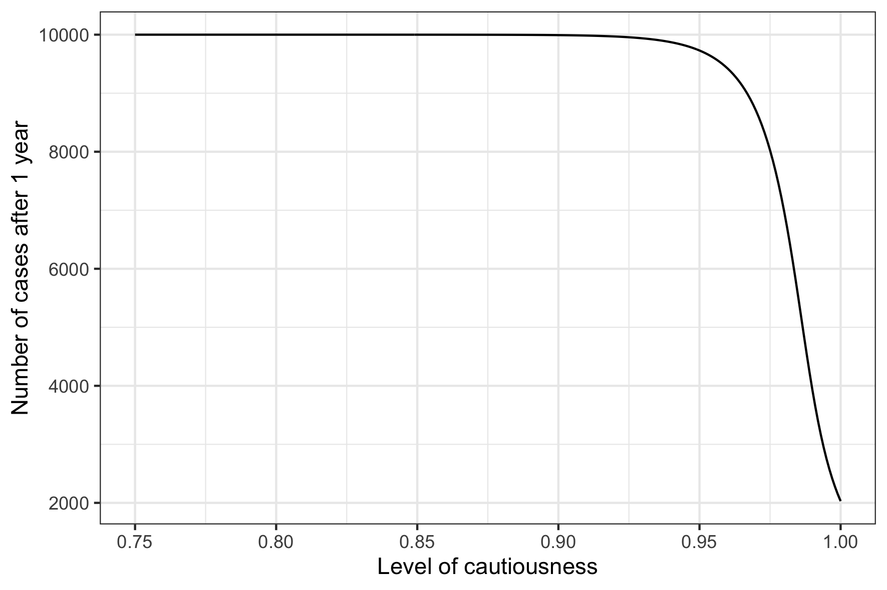
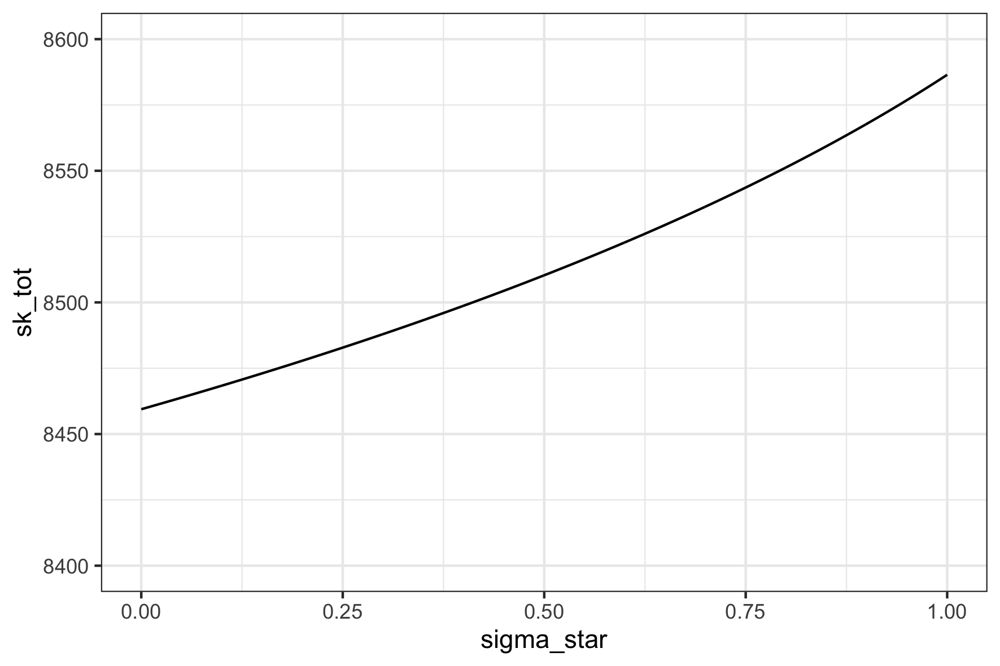

# What is the impact of being more cautious if you know COVID cases?

### The idea

Whilst self-isolating with Christmas-acquired COVID-19, I wondered if a) peole were more cautious about social mixing is people they knew had recently had COVID-19, and b) if this could delay the epidemic peak or change the resulting number of cases.

Using a simple transmission model with an SEIR structure and some quick probability theory, I tested this idea in a theoretical way.

### How many COVID cases does the average person know?

To set up the model, we need to know: the probability that a person knows a COVID case and the number of COVID cases the average person knows.

The probability that any one person is or has been a case in the current variant epidemic is C = (I + R)/N. 

The the chance that you don't know any cases is the chance that every one of the people you know is not a case, i.e. (1 - C)&omega;, where &omega; is the number of people in your social circle. Therefore, the chance that you know at least one case is 1 - (1 - C)&omega;.

This allows us to set up a second susceptibles compartment (Sk) of people who have a different transmission risk because they know at least one COVID case. People move from the naive, full risk susceptible compartment (S) to Sk at the rate of S(1 - (1 - C)&omega;).

I also wanted transmission avoiding behavious to depend on how many COVID cases you know - it seems plausible that the more cases we know, the more cautious we think we should be. 

The average number of cases an individual knows at time t is xt. Given they are already in the Sk compartment and know at least one case, we multiply the number of people you know by C:

xt = 1 + C(&omega;-1)

I hypothesised (wildly) that cautiousness is a sigmoid function of the number of people you know who are cases. i.e. knowing one or two cases doesn't worry you too much, but after you know a threshold number you reach cautiousness saturation.

Decrease in transmission risk at time t (or cautiousness) is:

&sigma;t = &sigma; * (1/(1 + exp(-&kappa;(xt - xm))))

Here, &sigma;* is a maximum cautiousness level], &kappa; is a measure of steepness of the curve, and xm is the mid point, or in our case at what number of cases known are we at half the level of our maximum cautiousness.

Using different maximum cautiousness levels, &kappa; = 5 and xm = 3, our function looks like this:

### The model

I use the rapid review on COVID-19 modelling from the Royal Society (Royal Soc, 2020) for setting up the model and parameters. 

Assuming density dependent transmission and a fully mixing population, the ODE set looks like this:

dS/dt = - S(1 - (1 - pk)&omega;) - &beta;SI

dSk/dt = S(1 - (1 - pk)&omega;) - &beta;SkI(1 - &sigma;t)

dE/dt =  &beta;SI + &beta;SkI(1 - &sigma;t)  - &alpha;E

dI/dt = &alpha;E - &gamma;I

dR/dt = &gamma;I

The model and results generating code is available on GitHub:

### Model intialisation and parameters

Next I parameterised the model. I assumed a population of 10,000, and a social circle of 100. The time step was 1 day, and the model was run for one year. Model runs were started with 1 infectious case, and S*(1 - (1 - 1/N)&omega;) people in the Sk compartment.

The latency or incubation period I took to be 5 days, with the rate of transition from one day to the next being 1/5.

The duration of infectiousness varies depending on the severity of the case and method of estimation (e.g. Bryne et al, 2020), but seems to be 5 - 10 days. Taking the median 7.5 days, the rate of recovery from infectiousness is 1/7.5. 

Using R0 and &gamma, we can estimate &beta; from the classic epidemiological formula R0 = &beta;N/&gamma;. The R0 for the omicron variant is thought to be just under 7 (Burki, 2021). So I estimated &beta; to be (7 * 1/7.5)/10,000.

### Results

Firstly I plotted the epidemic curve. Here is I (number infected) for five &sigma;* scenarios: 0, 0.2, 0.5, 0.8, and 0.99 proportion decreases in transmission risk at maximum cautiousness. The increased cautiousness can lead to a delayed, lower peak in numbers of infectious people at medium levels. At a high level the peak is not delayed but is far flatter.

By the end of 1 year, in cautiousness scenarios below 0.95 everyone in the population had been a case. This could partly be due to fewer infections occurring over the period of the epidemic and to the system not having reached equilibrium some the highest values of &sigma; * .

The more cautiousness the more people knew cases before they were infected, due to the delayed peak (more time to convert from S to Sk):

### Thoughts

If people are a little cautious when they know cases, there could lead to deceleration in the force of infection and a delayed epidemic peak without impacting overall case numbrs. If people are extremely cautious when you know a certain number of cases there could be a reduction in the total number of cases. 

Most infections were happening in the first 2 weeks after COVID-19 was introduced, so the impact of this effect would be at the start of the epidemic. This is likely to be the reason that cautiousness does not have a big effect unless is is very high (0.95 or more): the virus was spreading too quickly for people's 'cautiousness' to have an effect.

However, it is not a realistic model prediction that 100% of the population catched COVID-19, as this has not been observed. In this model, they do because I have not taken into accoun vaccinated-derived or natural immunity in the population, government restrictions (social distancing, contact tracing, and self-isolation), stochastic processes, heterogeneity, and assortative mixing patterns. These factors reduce the rate of transmission and protect some of the population from infection. I am therefore over-estimating how much transmission there will be. 

### References

Royal Society Science in Emergencies Tasking - COVID (SET-C) Committee (2020). Reproduction number (R) and growth rate (r) of the COVID-19 epidemic in the UK: methods of estimation, data sources, causes of heterogeneity, and use as a guide in policy formulation. https://royalsociety.org/-/media/policy/projects/set-c/set-covid-19-R-estimates.pdf

Burki, T. K. (2021). Omicron variant and booster COVID-19 vaccines. Lancet Respiratory Medicine. doi:10.1016/S2213-2600(21)00559-2

Byrne, A. W., McEvoy, D., Collins, A. B., et al (2020). Inferred duration of infectious period of SARS-CoV-2: rapid scoping review and analysis of available evidence for asymptomatic and symptomatic COVID-19 cases. BMJ Open 10:e039856. doi:10.1136/bmjopen-2020-039856

